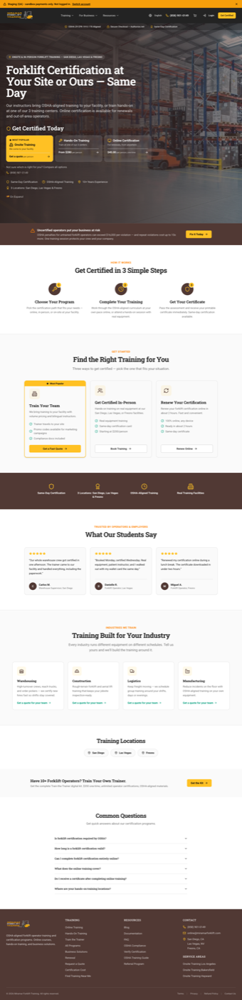
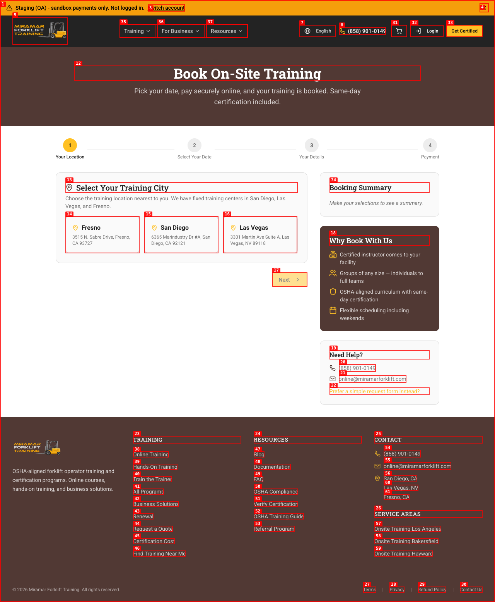
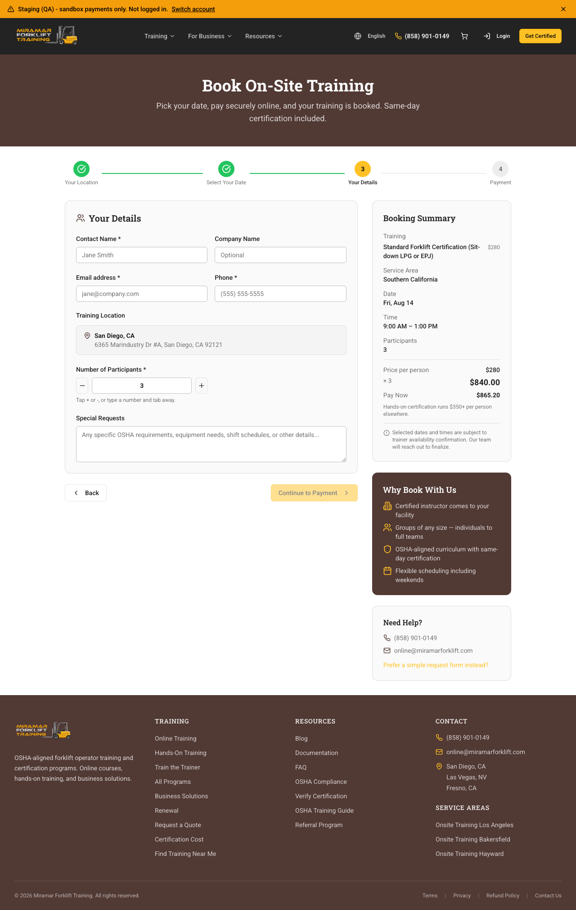
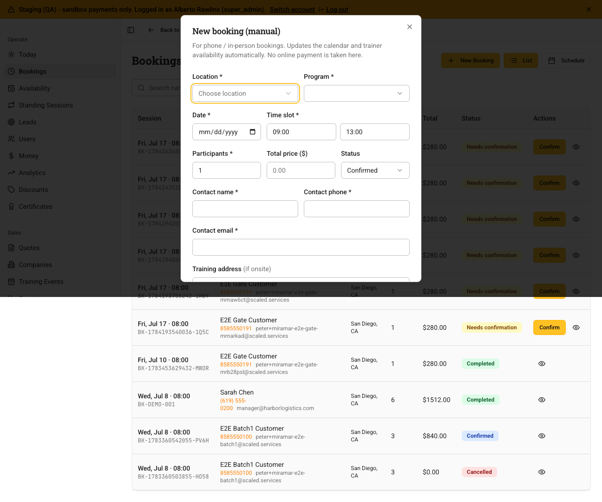
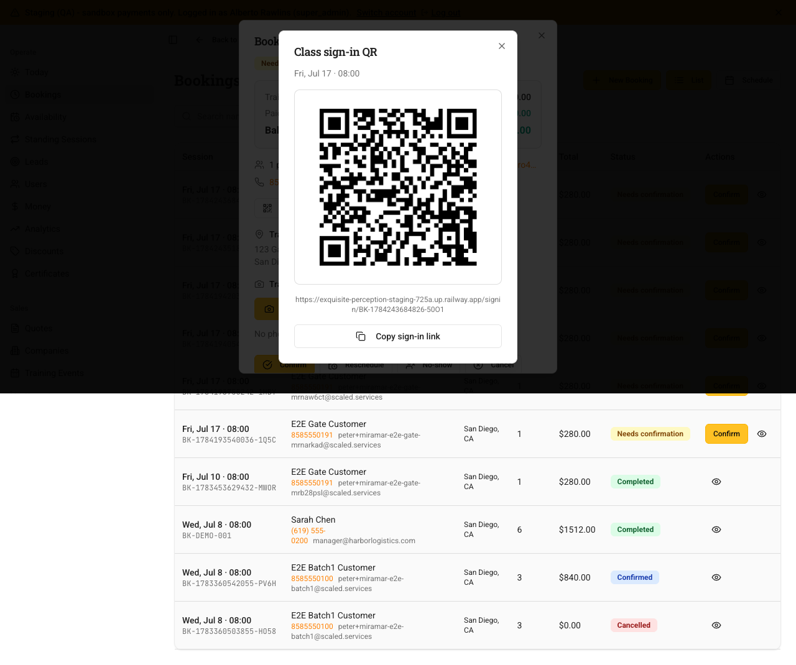
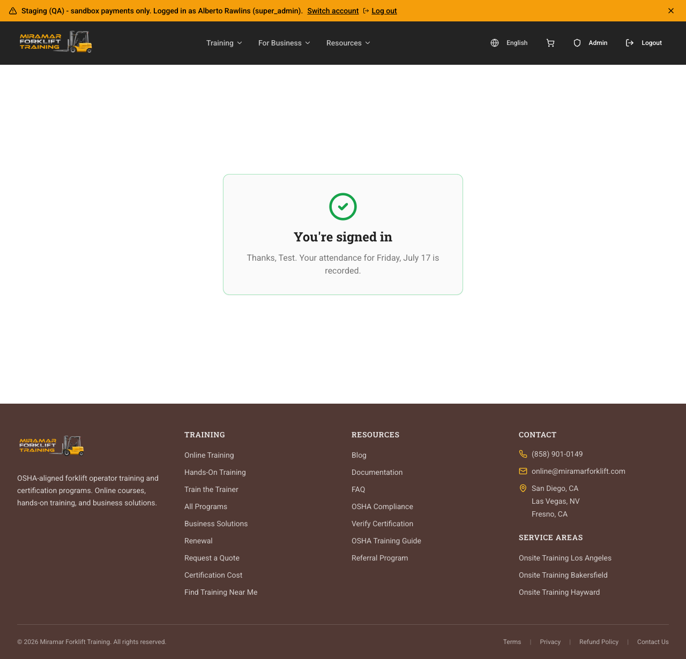
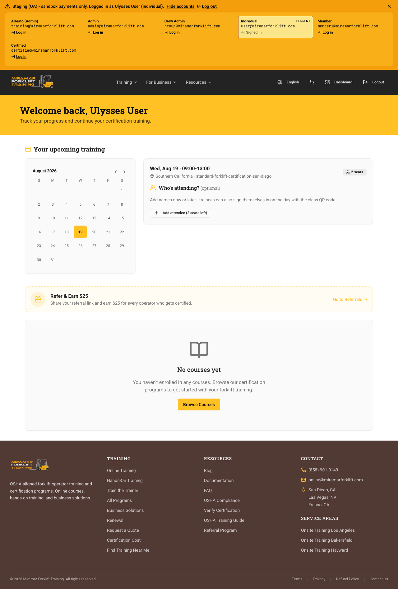
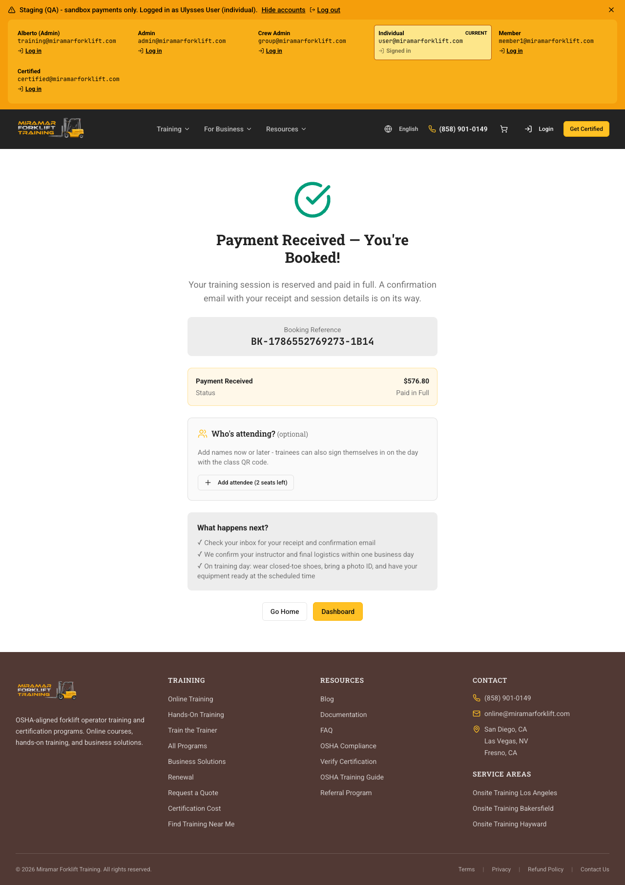

# E2E QA Run — 2026-08-12 (staging)

Target: https://exquisite-perception-staging-725a.up.railway.app
Triggered by: Alberto demo failure (2026-08-11). Goal: verify every fix + new
feature actually works on staging before handing back to Alberto.
Method: live browser, driving the DOM (browser tool refs go stale on this app),
screenshots as evidence. Payments in sandbox (Authorize.net test card, no real
charge). All test accounts share password `DemoPass!234`.

## Result summary

| # | Use case | Result | Screenshot |
|---|----------|--------|-----------|
| A | Homepage + pricing (onsite "Get a quote", hands-on $280) | ✅ PASS | A-homepage.png |
| B1 | City picker: loads, 3 cities only (SD/LV/Fresno), no "Staging Test" row | ✅ PASS | B1-city-picker.png |
| B2 | City selection + schedule: 4-hr blocks 9–1 / 1–5, Mon/Wed/Fri for SD | ✅ PASS | B2-city-selected.png |
| B3 | Participant stepper (−/+/type-on-blur), summary updates | ✅ PASS | B3-details-stepper.png |
| C | QA account switcher present + switches between accounts | ✅ PASS | (in-flow) |
| D | Alberto login training@miramarforklift.com → super_admin → /admin | ✅ PASS | (in-flow) |
| E | Admin "New Booking" manual booking dialog opens, full form | ✅ PASS | E-new-booking-dialog.png |
| F | Admin booking → "Class sign-in QR" shows scannable QR + copy link | ✅ PASS | F-signin-qr-dialog.png |
| G | Public QR sign-in /signin/{bookingNumber}: form → submit → success, attendee persisted (source=signin, checkedIn, openSeats updated) | ✅ PASS (full loop) | G-signin-success.png |
| H | Customer dashboard "Your upcoming training": mini calendar (booked date highlighted) + booking card + seat tracking | ✅ PASS | H-dashboard-upcoming-training.png |
| I | Booking confirmation "Who's attending?" optional name entry | ✅ PASS | I-booking-confirmation-attendee.png |

## Evidence (screenshots)

**A — Homepage: onsite "Get a quote", hands-on $280**

**B1 — City picker: 3 real cities, loading skeleton, no QA row**

**B3 — Details step: participant stepper (− 3 +), summary updates**

**E — Admin "New Booking" manual booking dialog**

**F — Class sign-in QR dialog (scannable QR + copy link)**

**G — Public QR sign-in success ("You're signed in")**

**H — Customer dashboard "Your upcoming training" (calendar + seat tracking)**

**I — Booking confirmation "Who's attending?" (optional names, seats left)**

## Bugs found this run

0. **(Found after the main run, during Alberto super_admin UAT) Admin "Today"
   page returned "Failed to load today dashboard" (500).** Root cause: more
   staging schema drift — this time at the COLUMN level, which my earlier
   table-existence check missed. Staging was missing `contacts.import_batch_id`,
   `companies.import_batch_id`/`source_era`, `training_events.import_batch_id`,
   and the `system_logs` and `page_views` tables. These power Today, the logger,
   and Analytics/Funnel. **Fixed:** added all missing columns + both tables;
   verified `/api/admin/today`, `/api/admin/analytics/funnel`, and
   `/api/admin/certifications` all return 200. **Lesson (now in README):** the
   schema-drift check must compare COLUMNS, not just table existence.

1. **(Note, not a regression) Photo-ID upsell location.** The "move photo-ID
   upsell above payment" change (commit 5486bca) applies to the **/checkout**
   page (online course cart). The **book-training payment step**
   (`CardPaymentSection`) is a separate flow and does NOT show the photo-ID
   add-on. Decision needed: does Alberto want the photo-ID upsell on the
   hands-on booking flow too, or only on online-course checkout? Currently only
   the latter has it.

2. **(Test-data note) "San Diego (Staging Test)" service-area row** still
   exists in the DB and appears on the public QR sign-in page for OLD bookings
   made against it. It is correctly filtered OUT of the new booking city picker,
   so it cannot be selected going forward. Recommend deactivating that QA row
   (set is_active=false) so legacy test bookings don't surface it.

3. **(Tooling, not app) browser_vision image analysis returns 404** on the
   current model (no image input). Workaround used: read content via DOM
   snapshots + capture screenshots directly. Does not affect the app.

## Regression checks (the demo breakers) — all confirmed fixed
- City picker loads on first click (loading skeleton present), no stray QA row.
- Participant count stepper: no "13" append, no stuck-at-1. −/+ and type-on-blur
  all work; booking summary tracks the count correctly.
- Registration no longer 500s (root cause was staging DB schema drift; columns +
  2 tables added, schema now in sync).

## Verified end-to-end loop (the headline new feature)
Admin opens a booking → "Class sign-in QR" → scannable QR → public
/signin/{bookingNumber} page → trainee enters name → "You're signed in" →
attendee record created (source=signin, checked_in_at set) → seat count updates
(1/1 → 0 open seats) → admin/purchaser can see it. Full loop PASSED.

## Environment / state after run
- Staging DB schema in sync with code (0 missing tables).
- Test accounts seeded on staging incl. training@miramarforklift.com (super_admin).
- ENABLE_QA_ACCOUNT_SWITCHER=true set on staging (banner live).
- One real sandbox booking created for H: BK-1786552769273-1B14 (user@, 2 seats).
- One test attendee signed into old booking BK-1784243684826-50O1 ("Test Trainee").
